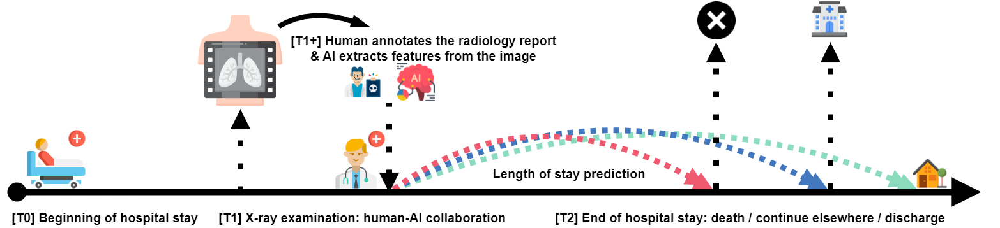

# xlungs-trustworthy-los-prediction

Part of the [xLUNGS](https://xlungs.mi2.ai) project. This directory contains code and the **TLOS** dataset associated with the [article](https://doi.org/10.1016/j.artmed.2024.103026)

> H. Baniecki, B. Sobieski, P. Szatkowski, P. Bombinski, P. Biecek. **Interpretable machine learning for time-to-event prediction in medicine and healthcare**. *Artificial Intelligence in Medicine*, 2024

```
@article{baniecki2025interpretable,
    title = {Interpretable machine learning for time-to-event prediction in medicine and healthcare},
    author = {Hubert Baniecki and Bartlomiej Sobieski and Patryk Szatkowski and Przemyslaw Bombinski and Przemyslaw Biecek},
    journal = {Artificial Intelligence in Medicine},
    volume = {159},
    pages = {103026},
    year = {2025},
    doi = {https://doi.org/10.1016/j.artmed.2024.103026}
}
```



## Data and code

The preprocessed **TLOS** dataset in the tabular form is available in [data](/data) under the [CC-BY-NC-ND-4.0](data/LICENSE) license. Raw X-ray data including images and radiology reports cannot be openly shared due to privacy concerns. For inquires, please write at [xlungs@pw.edu.pl](mailto:xlungs@pw.edu.pl). 

Exemplary code for performing the described analysis is available in [code](/code) under the [MIT](code/LICENSE) license. It is accompanied by the key metadata checkpoints in [results](/results). For inquires, please write at [h.baniecki@uw.edu.pl](mailto:h.baniecki@uw.edu.pl).

## Dependencies

The analysis was performed using the following software:
- R v4.2.1 
    - `survex` v0.2.2 updated at https://github.com/ModelOriented/survex/tree/xlungs-trustworthy-los-prediction
    - `mlr3proba` v0.4.17 accessed from https://github.com/mlr-org/mlr3proba
    - `mboost` v2.9.7 updated with the following fix https://github.com/boost-R/mboost/pull/118
- Python v3.8.13
    - `pyradiomics` v3.0.1
    - `pydicom` v2.3.0

## Acknowledgements

This work was financially supported by the Polish National Center for Research and Development grant number `INFOSTRATEG-I/0022/2021-00`, and carried out with the support of the Laboratory of Bioinformatics and Computational Genomics and the High Performance Computing Center of the Faculty of Mathematics and Information Science, Warsaw University of Technology.